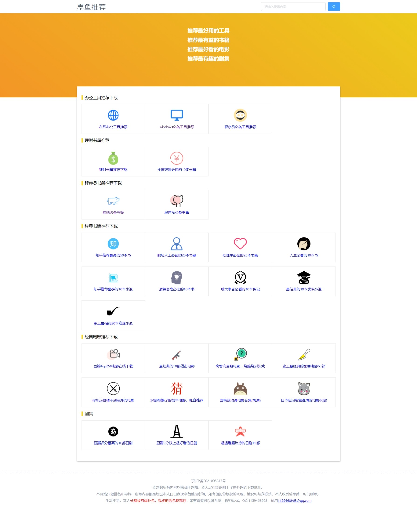

# 墨鱼推荐
一个纯前端的资源分享网站，采用网盘+网页的形式实现分享。为了便于seo采用nuxt框架。

网站效果可点击查看 [墨鱼推荐](https://www.mfish.xyz/)

## 启动

```bash
# 安装npm包
$ npm install

# 启动项目，端口4001，可在nuxt.config.js里修改
$ npm run dev

# 部署
$ npm run build
$ npm run start

# 生成静态项目
$ npm run generate
```
## 配置项
页面和端口等相关配置，可在nuxt.config.js里查看

友盟统计的配置在global.js里查看


## 页面效果


